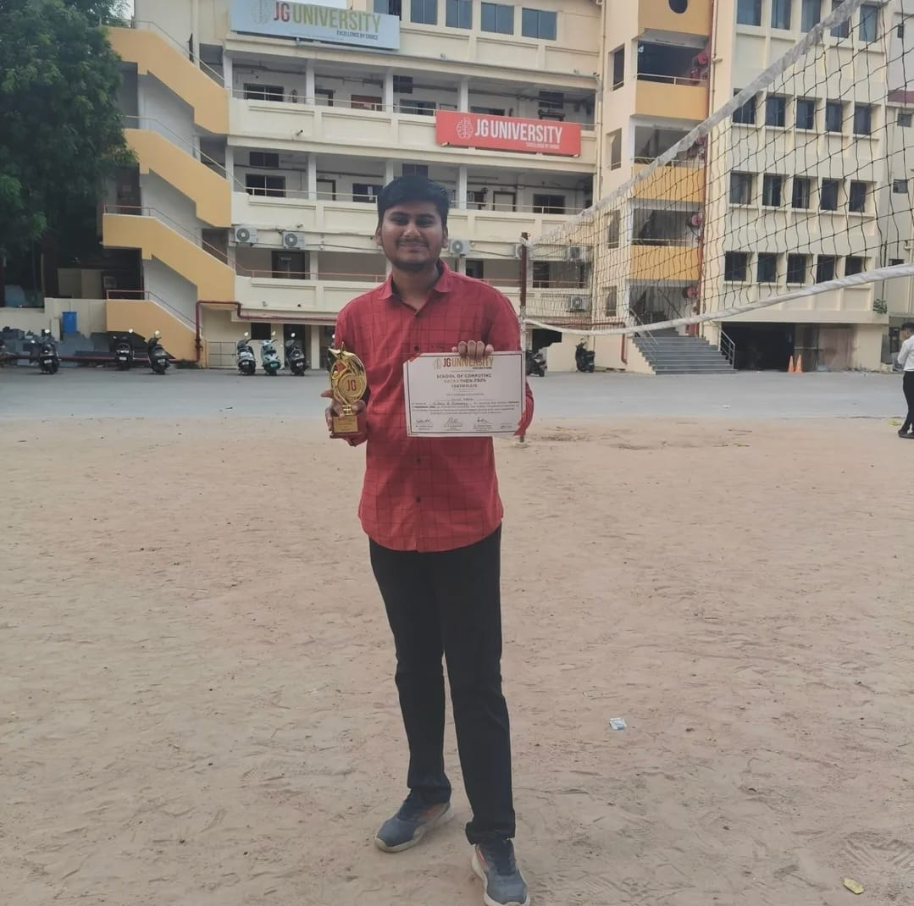
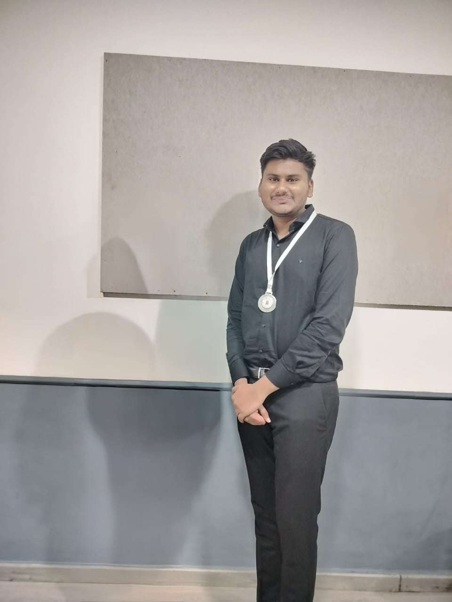

<h1 align="center">Hi 👋, I'm Keval Mehta</h1>
<h3 align="center">B.Sc. IT (Data Science & Analytics) Student from India 🇮🇳</h3>

  

---

🎓 B.Sc. IT (Data Science & Analytics)

🌱 Currently Learning
- Python
- C++
- Java
- Git & GitHub
- SQL

💡 Interested In
- Web Development
- Data Science
- Open Source
- Programming

⚡ Motto

---

---

---

---

Email : keval.mehta.1311@gmail.com 

---

<table align="center">
<tr>
<td align="center">
 
<b>🏆 University Coding Competition</b>
</td>

<td align="center">
 
<b>🥈 Technical Event Achievement</b>
</td>
</tr>
</table>

---

---

---

---

---

---

<h3 align="center">
⭐ From Beginner to Better Every Day ⭐
</h3>
